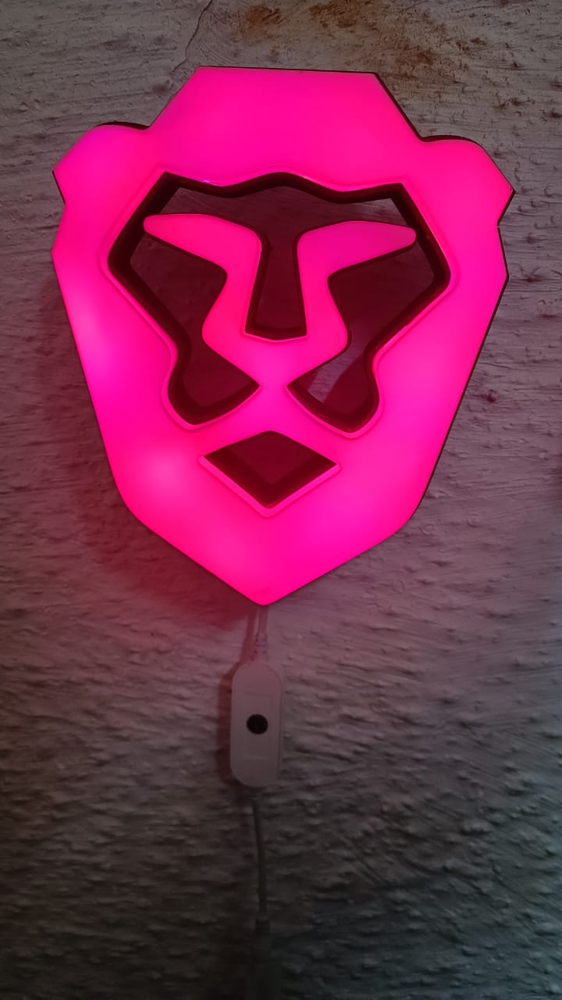

# brave-lamp
3D printed Brave lamp, that turns on whenever I "clock in" to work

This has been kind of an ongoing project for the last 6 months.
The project includes the python sourcecode and the STL for the model.

